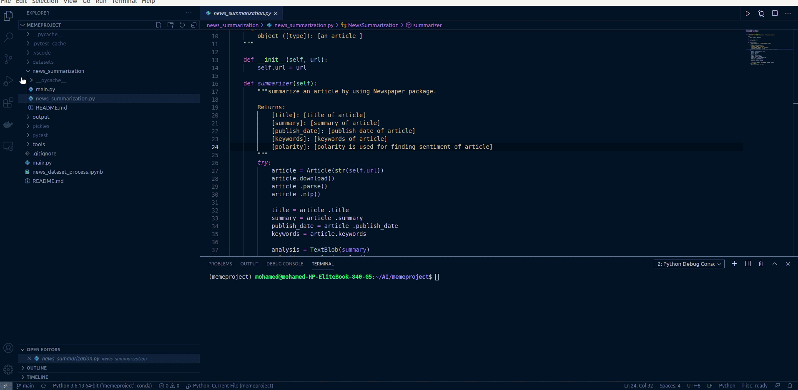

# News_summarization

        """
        summarize an article by using Newspaper package.

        Input:
            [URL]: [The URL for an article]

        Returns:
            [title]: [title of article]
            [summary]: [summary of article]
            [publish_date]: [publish date of article]
            [polarity]: [polarity is used for finding sentiment of article]
            [keywords]: [keywords of article]
        """

# Demo

